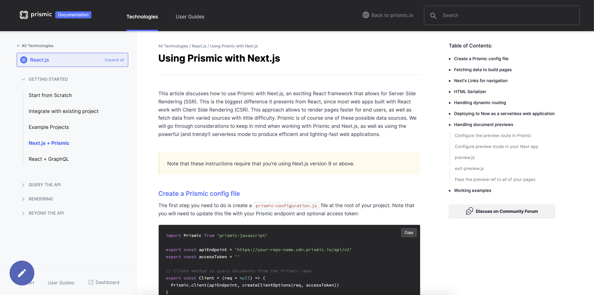
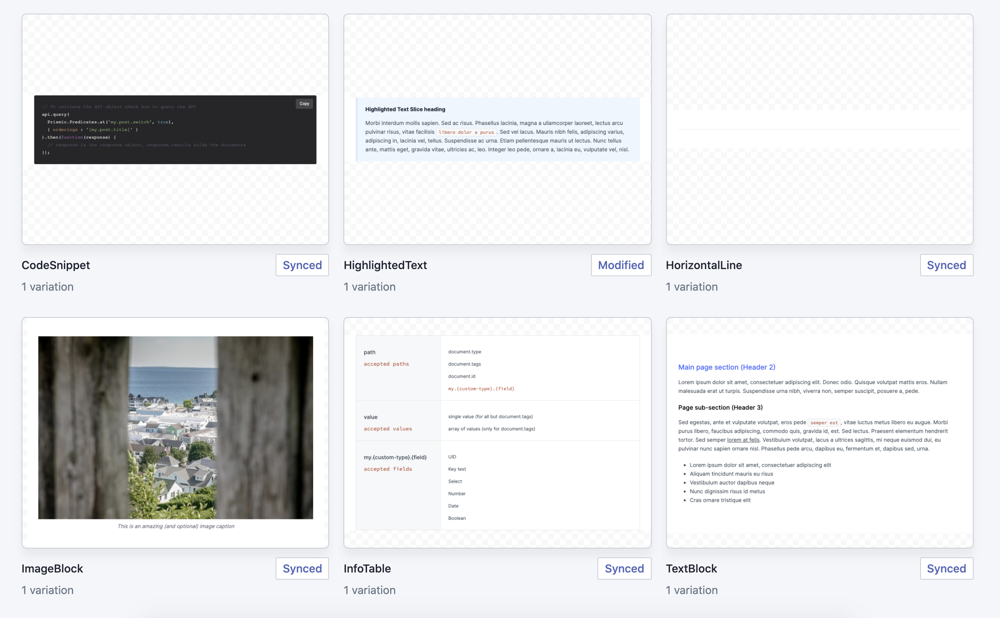

# Prismic Documentation Slice Library - Next.js

A Prismic slice library featuring some of the components used to build the [Prismic developer documentation](https://prismic.io/docs). The project is built with [Next.js](https://nextjs.org) and [Slice Machine](https://slicemachine.dev) and was created for the [Prismic #SliceContest](https://prismic.io/blog/slice-contest?utm_campaign=devexp&utm_source=github&utm_medium=slicecontestpost).




Here are some of the available slices in this library:



Check out the [live Storybook demo](https://sm-prismic-docs-library-react.vercel.app/) of these slices.

## 📚 &nbsp;Useful Links

- [📣 &nbsp;Contest Announcement Blog Post](https://prismic.io/blog/slice-contest?utm_campaign=devexp&utm_source=github&utm_medium=slicecontestpost), check rules and additional information there!
- [🌐 &nbsp;Contest Forum Section](https://community.prismic.io/c/slice-machine/slicecontest), get help and share feedback here~
- [🔪 &nbsp;Slice Machine Documentation](https://www.slicemachine.dev/documentation), to learn more about Slice Machine
- [📖 &nbsp;Prismic React Documentation](https://prismic.io/docs/reactjs/getting-started/getting-started-from-scratch), to learn more about Prismic with React

## 🏁 &nbsp;Getting Started

Here's how to get started using this project.

### Setting up the Project

Start by downloading the project and opening a terminal at the root of the project files. Run the following command to install the project dependencies.

```bash
npm install
```

### Launching the Slice Builder

To launch the Slice Builder you need to run 2 terminals: one for Storybook, one for the Slice Builder itself.

```bash
# On a first terminal
npm run storybook

# On the second terminal
npm run slicemachine
```

This will launch Storybook on port `8888` and the Slice Builder on port `9999`, you can open a third terminal to create slices from or launch other commands...

> ⚠ Storybook is known for being quite picky with its dependencies. If you experience a blank page when running it with a lot of errors in the browser console try deleting your lock file and installing dependencies again, should fix the issue.

For comprehensive documentation about using the Slice Builder check the dedicated [documentation](https://www.slicemachine.dev/documentation/slice-builder#using-the-slice-builder).
